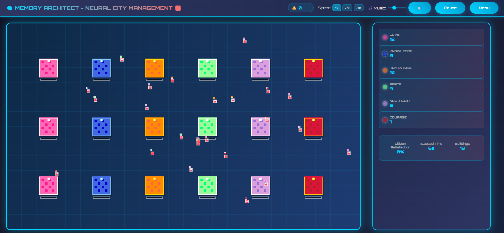

# 🧠 Memory Architect
### *Build the Neural City of Tomorrow*

> **What if memories were physical resources you could collect, store, and distribute?**

Welcome to Memory Architect - a mind-bending city management game where you're the architect of a neural metropolis! Your citizens don't need food or water... they need **memories** to survive and thrive.

## 🎮 The Concept

In this cyberpunk-inspired world, you manage a city where:
- **Buildings are giant memory banks** that store different types of human experiences
- **Citizens are living souls** who wander the city seeking specific memories to feel fulfilled
- **Your job** is to collect, preserve, and distribute memories before they decay

## 🌈 Six Types of Memories

Each memory type has its own unique properties and visual style:

| Memory Type | Icon | Purpose | Color |
|-------------|------|---------|-------|
| **Love** 💖 | Pink Radiance | Emotional connections | Hot Pink |
| **Knowledge** 📚 | Blue Wisdom | Learning & growth | Royal Blue |
| **Adventure** 🗺️ | Orange Energy | Thrills & exploration | Bright Orange |
| **Peace** 🕊️ | Green Serenity | Calm & meditation | Soft Green |
| **Nostalgia** 🌅 | Purple Dreams | Past experiences | Lavender |
| **Courage** ⚔️ | Red Power | Bravery & strength | Crimson |

## ✨ Core Gameplay Loop

1. **👀 Watch Your Citizens** - Colorful souls roam your neural city, each seeking specific memories
2. **🎯 Collect Memories** - Different memory types generate automatically over time
3. **🏗️ Manage Buildings** - Click memory banks to distribute stored experiences
4. **😊 Fulfill Souls** - Satisfied citizens glow and eventually transcend, earning you rewards
5. **📈 Scale Up** - Use coins to buy power-ups, assistants, and game-changing boosts

## 🚀 Premium Features

### Register to unlock:
- **🏆 Global Leaderboards** - Compete with Memory Architects worldwide
- **🛍️ Power-Up Shop** - Efficiency boosters, AI assistants, offline progress
- **💾 Progress Saving** - Never lose your neural empire
- **⚡ Special Effects** - Spectacular visual feedback and animations

## 🎯 Strategic Depth

- **Memory Decay**: Stored memories deteriorate over time - use them or lose them!
- **Citizen Satisfaction**: Happy souls boost your currency generation
- **Speed Control**: Manage time flow (1x, 2x, 3x) to optimize your strategy
- **Resource Balancing**: Different memory types generate at varying rates

## 🎨 Visual Excellence

- **Cyberpunk Aesthetic**: Neon colors, futuristic UI, and sci-fi atmosphere
- **Particle Effects**: Memories flow as glowing orbs between buildings
- **Citizen Emotions**: Visual feedback shows satisfaction levels at a glance
- **Smooth Animations**: Butter-smooth 60fps gameplay with reactive elements

## 🎲 Perfect For

- **Strategy Game Lovers** who enjoy resource management with a twist
- **Simulation Fans** who like watching systems interact and evolve
- **Casual Gamers** who want something unique but easy to pick up
- **Sci-Fi Enthusiasts** who love cyberpunk aesthetics and mind-bending concepts

---

## 🚀 Getting Started

1. **Choose Your Path**: Register for full features or play as guest
2. **Learn the Ropes**: Follow the interactive tutorial
3. **Start Small**: Begin with 18 memory banks and 20 citizens
4. **Scale Up**: Unlock premium features and compete globally
5. **Master the Art**: Become the ultimate Memory Architect!

---

*Ready to architect the minds of tomorrow? Your neural city awaits!* 🏙️✨